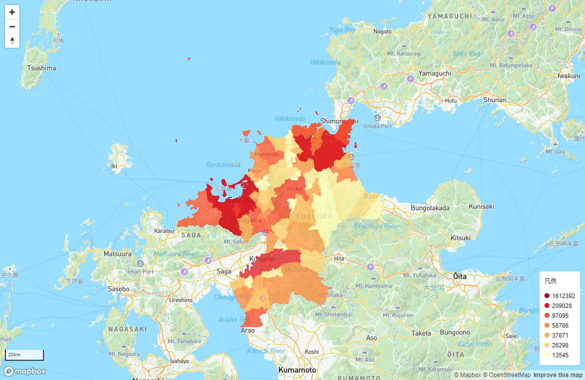

# Tutorials: 階級区分図の表示

既存の各種マップライブラリを利用して、階級区分図をマップに表示できます。  
いくつかの代表的なライブラリを用いて、階級区分図を表示するサンプルを使って学習します。



## ランクの取得
凡例および描画スタイルに必要なランクデータを取得します。  
サンプルマップは、該当件数を均等にしたランクデータを使用しています。

### 数値範囲を均等にしたランクを取得
#### リクエスト (/stats/rank/range)
```JS
(async function() {
    const query = new URLSearchParams({
        database:'KOK', //国調統計データ
        store:'CITY',   //市区町村ストア
        column:'N1',    //人口
        area:'40',      //福岡県エリア
        division: 7     //ランク7分割
    });
    const response = await fetch(`https://<<FQDN>>/api/stats/v1/stats/rank/range?${query}`, {
        headers:{
            Authorization:'<<API認証トークンまたはAPIキー>>'
        }
    });
    const data = await response.json();
    console.log(data.database);
})();
```
<button class='block text-white bg-blue-700 hover:bg-blue-800 focus:ring-4 focus:outline-none focus:ring-blue-300 font-medium rounded-lg text-sm px-5 py-2.5 text-center dark:bg-blue-600 dark:hover:bg-blue-700 dark:focus:ring-blue-800' data-path='/stats/rank/range' data-query='{"database":"KOK","store":"CITY","column":"N1","area":"40","division":7}'>
  サンプル
</button>

### 該当件数を均等にしたランクを取得
#### リクエスト (/stats/rank/frequency)
```JS
(async function() {
    const query = new URLSearchParams({
        database:'KOK',  // 国調統計データ
        store:'CITY',   //市区町村ストア
        column:'N1',    //人口
        area:'40',      //福岡県エリア
        division: 7     //ランク7分割
    });
    const response = await fetch(`https://<<FQDN>>/api/stats/v1/stats/rank/frequency?${query}`, {
        headers:{
            Authorization:'<<API認証トークンまたはAPIキー>>'
        }
    });
    const data = await response.json();
    console.log(data.database);
})();
```
<button class='block text-white bg-blue-700 hover:bg-blue-800 focus:ring-4 focus:outline-none focus:ring-blue-300 font-medium rounded-lg text-sm px-5 py-2.5 text-center dark:bg-blue-600 dark:hover:bg-blue-700 dark:focus:ring-blue-800' data-path='/stats/rank/frequency' data-query='{"database":"KOK","store":"CITY","column":"N1","area":"40","division":7}'>
  サンプル
</button>

## ポリゴンデータの取得
### GeoJSON形式
#### リクエスト (/map/datamap/polygon/geojson)
```JS
(async function() {
    const query = new URLSearchParams({
        database:'KOK', //国調統計データ
        store:'CITY',   //市区町村ストア
        column:'N1',    //人口
        area:'40106'    //北九州市小倉北区エリア
    });
    const response = await fetch(`https://<<FQDN>>/api/stats/v1/map/datamap/polygon/geojson?${query}`, {
        headers:{
            Authorization:'<<API認証トークンまたはAPIキー>>'
        }
    });
    const data = await response.json();
    console.log(data.database);
})();
```
<button class='block text-white bg-blue-700 hover:bg-blue-800 focus:ring-4 focus:outline-none focus:ring-blue-300 font-medium rounded-lg text-sm px-5 py-2.5 text-center dark:bg-blue-600 dark:hover:bg-blue-700 dark:focus:ring-blue-800' data-path='/map/datamap/polygon/geojson' data-query='{"database":"KOK","store":"CITY","column":"N1","area":"40106"}'>
  サンプル
</button>


## サンプル
マップライブラリを利用したサンプルです。

- [OpenLayers <i class="fa fa-external-link-alt" aria-hidden="true"></i>](sample/openlayers.html)
- [Leaflet <i class="fa fa-external-link-alt" aria-hidden="true"></i>](sample/leaflet.html)
- [MapLibre GL JS <i class="fa fa-external-link-alt" aria-hidden="true"></i>](sample/maplibre.html)
- [Mapbox GL JS <i class="fa fa-external-link-alt" aria-hidden="true"></i>](sample/mapbox.html)
- [Google Maps API <i class="fa fa-external-link-alt" aria-hidden="true"></i>](sample/google.html)